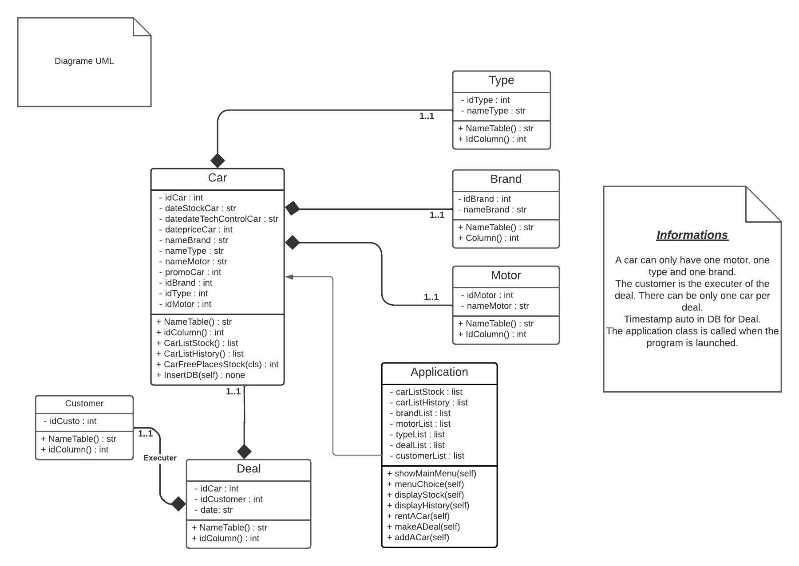

# Projet application de gestion pour concessionnaire.

1. Notre application se lance dans une console en faisant "python3 main.py \<argument>". 
Pour plus d'information et d'aide l'utilisateur peut faire "python3 main.py -h" afin de recevoir 
toutes les informations nécessaire au démarrage de la solution.
2. La solution permet à l'utilisateur de gérer son concessionnaire. Il peut ajouter des clients dans une base
de données déjà créée. Il peut ajouter des voitures avec son type, sa marque, son prix, son type de moteur.
Il peut voir son stock de voiture ainsi que son historique de vente. Il peut soit vendre une voiture, soit
la louée à des comptes clients. 
3. Les comptes clients possèdent un nom, un prénom, une adresse, un numéro de téléphone.
4. L'utilisateur peut tout gérer de manière simplifiée soit via une interface graphique, soit via l'interface
console.

- Voici notre diagramme UML correspondant à la solution :

- Et voici notre schéma d'architecture : 

