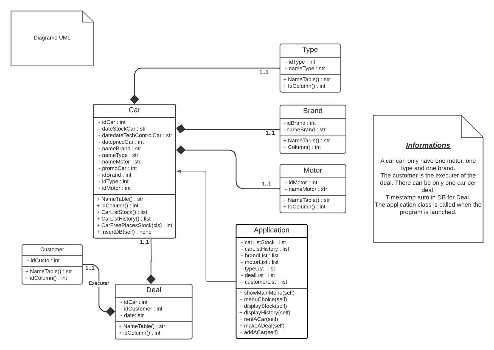
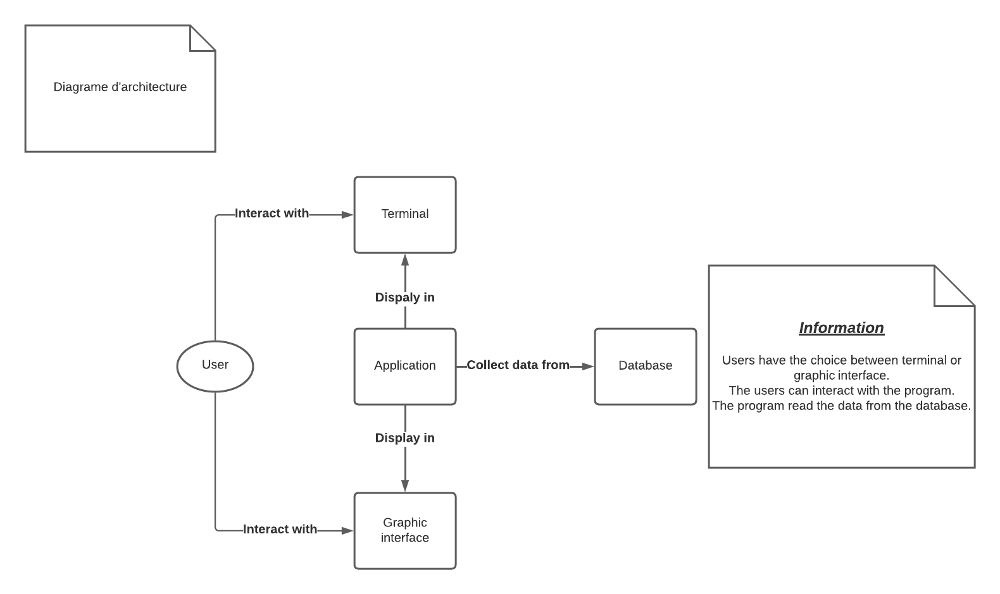

# Python-project : Application concessionnaire

*<u> __jeudi 13 octobre 2022__ => Rencontre avec le client :</u>*

- Nom : axel air responsable concessionnaire, gestion voitures marques différentes, types de voiture, types de moteur

- Appli pour encoder les voitures, vendre une voiture, depuis combien de temps elle est dans le stock

- Compte client pour les promos

- Location voiture occasion (délai dans une zone géo, + prix)

- basé en local

- Garage avec 40 emplacements sur deux étages avec ascenseurs pour voiture (max 40 voitures dans le stock en simultané)
concess bâtiment différent

- Interface graphique + console => fonctionne mais minimaliste, efficace

- Avoir le suivi des ventes etc avec historique... gérer les réservations

- Gérer le control technique, si une voiture doit passer dans 1 mois, elle ne peut pas être achetée ni louée
(contrainte!!)

- Fin de semaine pro 21/10 : cahier des charges;

- 2 - 3 semaines : MVP

=> python (new release)

*<u>__20/10__ => Réunion avec le client :</u>*

- Présentation MVP :
  - Le projet était bien avancé, il y avait déjà l'interface graphique et l'interface console. Cependant,
  nous ne gérions pas encore toutes les exceptions. Par exemple le client a essayé de rentrer des lettres dans un 
  numéro de téléphone et aucunes erreurs n'a été détectées. Où quand le client à valider la création de la voiture,
  rien ne se passait car on avait pas encore programmer l'injection sql pour mettre à jour la db.
  - Appart ça, le client était content de notre GUI et de la manière dont on gérait la console.
  - Présentation de notre cahier des charges (cfr. __cdc_bamboo_concess.pdf__)

*<u>__10-11__ => Réunion avec le client :</u>*

- Présentation de notre uml 
- Présentation de notre schéma d'architecture 

*<u>__8/12__ => Réunion finale avec le client :</u>*

- Présentation finale du projet terminé.

- Le client était très content de notre travail. Il n'a rien eu à dire.
